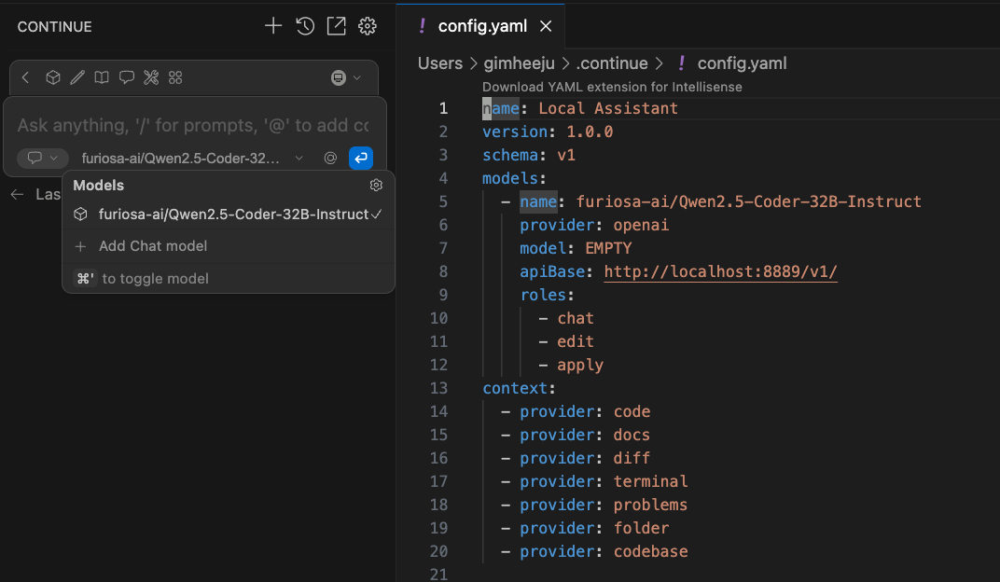
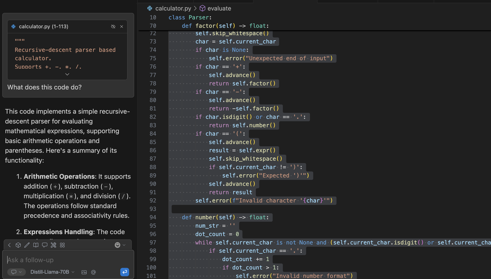
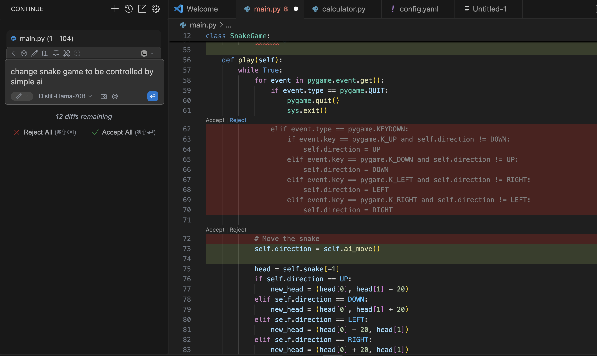

# NPU Accelerated Coding Assistant (Continue Integration Guide)
You might want to try using the NPU-accelerated Code Assistant in VS Code. In this document, we will explore how to use [Continue](https://continue.dev) with RNGD, FuriosaAI’s flagship AI accelerator, and the FuriosaAI SDK, an AI serving framework. This setup enables natural language‑based code completion, refactoring, and explanation within the VS Code environment. 

## 1. Overview

Continue is a VS Code extension that connects to a local or remote LLM backend and provides AI-assisted features in the coding environment.

Two primary usage modes are supported:

- **Chat Mode (Cmd/Ctrl+L)**: Select a block of code and enter chat mode to ask questions or request explanations from the model.
- **Edit Mode (Cmd/Ctrl+I)**: Select code and enter edit mode to modify it using natural language instructions.

These modes allow for interactive code understanding, transformation, and assistance.

For detailed usage, see the [Continue Documentation](https://docs.continue.dev/).


## 2. Set Environments 

### Requirements
- RNGD server or Endpoint API
- FuriosaSDK 2025.3.0.

## Setup
- Install the `Continue` extension from the VS Code Marketplace.
- Choose which model to use at [FuriosaAI Huggingface Hub](https://huggingface.co/furiosa-ai/models) and Run Furiosa LLM Server (we'll use [Qwen2.5-Coder-32B-Instruct](https://huggingface.co/furiosa-ai/Qwen2.5-Coder-32B-Instruct))

```
furiosa-llm serve furiosa-ai/Qwen2.5-Coder-32B-Instruct --devices "npu:0,npu:1" --port 8889
```

This command will runs an OpenAI compatible server with Chat API and Completions API endpoints.

## 3. Connecting Continue to the Furiosa LLM Server

You can configure endpoints for Continue by modifying its `config.yaml` file with the FuriosaAI server information.
On the Continue page, click the settings icon to access and edit the `config.yaml` file with the FuriosaAI server information. 



### config.yaml

```yaml
name: Local Assistant
version: 1.0.0
schema: v1
models:
  - name: furiosa-ai/Qwen2.5-Coder-32B-Instruct
    provider: openai
    model: EMPTY
    apiBase: http://localhost:8889/v1/
    roles:
      - chat
      - edit
      - apply

context:
  - provider: code
  - provider: docs
  - provider: diff
  - provider: terminal
  - provider: problems
  - provider: folder
  - provider: codebase
```

## 4. Using Continue
Once Continue is connected to the Furiosa LLM server, you can begin using it directly within your development workflow. Here are practical ways to utilize its functionality:

### 4.1 Chat-Based Code Explanation
To understand a block of code:

1. Select the code segment in your project.
1. Press Ctrl+L (or Cmd+L on macOS) to enter Chat Mode.
1. Type your question, such as "What does this function do?" or "Explain the logic here."

The model will respond with a natural language explanation based on the selected code and project context.



### 4.2 Edit-Based Code Modification
To modify or refactor code:

1. Select the code to be changed.
1. Press Ctrl+I (or Cmd+I on macOS) to enter Edit Mode.
1. Enter an instruction like "Rename the variable for clarity" or "Convert this loop to a list comprehension."

Continue will generate the modified code, which you can accept or reject using buttons in the UI.

Alternatively, you can open a blank file, press Ctrl+I, and describe the idea you want to implement. Continue will generate initial code based on your description.



## 5. References

- Official Continue Documentation: [https://docs.continue.dev](https://docs.continue.dev)
